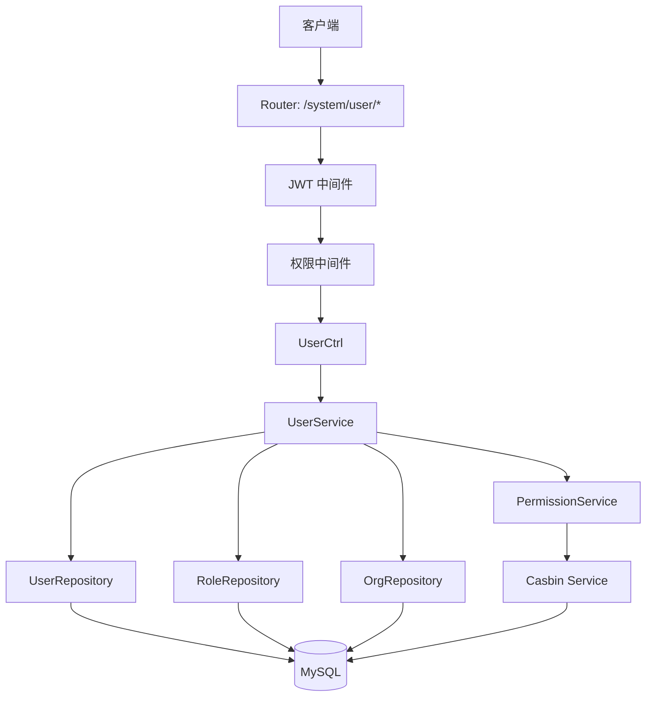
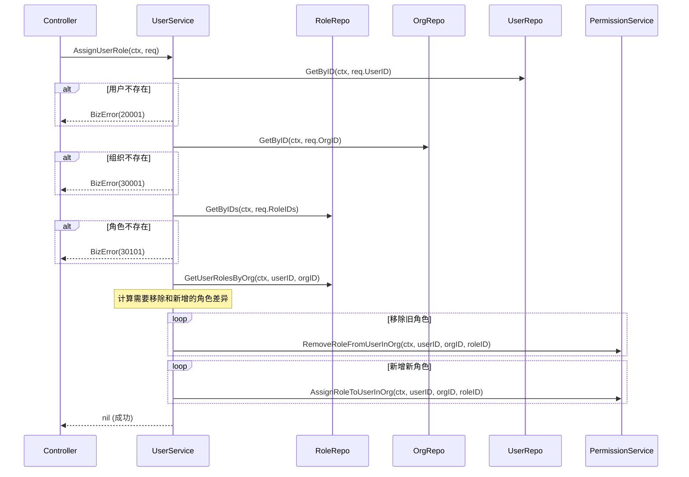

# 设计文档：用户管理模块（Casbin RBAC）

## 概述

本设计基于已有项目分层架构（Controller → Service → Repository），为用户管理模块新增四个 API 接口。核心设计决策：

1. 复用已有的 `UserRepository`、`RoleRepository` 接口，新增必要的查询方法
2. 角色分配采用"先数据库后 Casbin"策略，Casbin 失败时回滚数据库操作
3. 用户列表查询通过 Repository 层 JOIN 查询一次性获取用户、组织、角色信息，避免 N+1 问题
4. 所有新功能使用 `pkg/errors` BizError 体系和 `pkg/response` BizResponse 统一响应

## 架构



请求流程：
1. Router 将请求路由到 UserCtrl 对应的 handler
2. Controller 绑定参数、校验 → 调用 Service
3. Service 编排业务逻辑，调用 Repository 获取/修改数据
4. 角色分配场景：Service 调用 PermissionService 同步 Casbin 策略
5. Controller 将 Service 返回的数据转换为 DTO 响应

## 组件与接口

### Controller 层：UserCtrl

在现有 `internal/controller/system/userCtrl.go` 中新增以下方法：

```go
// GetUserList 获取用户列表（分页、过滤）
func (u *UserCtrl) GetUserList(c *gin.Context)

// GetUserDetail 获取用户详情
func (u *UserCtrl) GetUserDetail(c *gin.Context)

// GetUserRoles 获取用户在组织下的角色
func (u *UserCtrl) GetUserRoles(c *gin.Context)

// AssignUserRole 分配用户角色（全量替换）
func (u *UserCtrl) AssignUserRole(c *gin.Context)
```

UserCtrl 需要新增依赖 `permissionService`，用于角色分配场景。

### Service 层：UserService

在现有 `internal/service/system/userSvc.go` 中新增以下方法：

```go
// GetUserList 获取用户列表（分页、过滤）
func (u *UserService) GetUserList(ctx context.Context, req *request.UserListReq) (*response.UserListResp, error)

// GetUserDetail 获取用户详情
func (u *UserService) GetUserDetail(ctx context.Context, userID uint) (*response.UserDetailItem, error)

// GetUserRolesByOrg 获取用户在组织下的角色
func (u *UserService) GetUserRolesByOrg(ctx context.Context, userID uint, orgID uint) ([]*response.RoleSimpleItem, error)

// AssignUserRole 分配用户角色（全量替换）
func (u *UserService) AssignUserRole(ctx context.Context, req *request.AssignUserRoleReq) error
```

UserService 已有 `userRepo`、`roleRepo`、`permissionService` 依赖，需新增 `orgRepo` 依赖用于组织存在性校验。

### Repository 层

需要在 `UserRepository` 接口中新增方法：

```go
// GetUserListWithFilter 获取用户列表（支持组织过滤、关键词搜索，包含关联数据）
GetUserListWithFilter(ctx context.Context, filter *request.UserListReq) ([]*entity.User, int64, error)
```

需要在 `OrgRepository` 接口中确认已有方法：
- `GetByID(ctx, id)` — 用于组织存在性校验

需要在 `RoleRepository` 接口中确认已有方法：
- `GetUserRolesByOrg(ctx, userID, orgID)` — 获取用户在组织下的角色
- `GetByID(ctx, id)` — 角色存在性校验

角色分配的数据库操作复用 `PermissionService` 中已有的方法链。

### 角色分配流程（AssignUserRole）



设计决策：使用差异计算（diff）而非"全删再全增"，减少不必要的 Casbin 策略变更，降低中间状态风险。复用 `PermissionService` 已有的单条角色分配/移除方法，每个方法内部已包含"数据库操作 + Casbin 同步 + 失败回滚"逻辑。

## 数据模型

### 请求 DTO

```go
// internal/model/dto/request/userReq.go 中新增

// UserListReq 用户列表请求
type UserListReq struct {
    Page     int    `form:"page" binding:"omitempty,min=1"`
    PageSize int    `form:"page_size" binding:"omitempty,min=1,max=100"`
    OrgID    uint   `form:"org_id" binding:"omitempty"`
    Keyword  string `form:"keyword" binding:"omitempty,max=50"`
}

// AssignUserRoleReq 分配用户角色请求
type AssignUserRoleReq struct {
    UserID  uint   `json:"user_id" binding:"required"`
    OrgID   uint   `json:"org_id" binding:"required"`
    RoleIDs []uint `json:"role_ids" binding:"required"`
}
```

### 响应 DTO

```go
// internal/model/dto/response/userResp.go 中新增

// UserListItem 用户列表项
type UserListItem struct {
    ID       uint   `json:"id"`
    Username string `json:"username"`
    Phone    string `json:"phone"`
    CurrentOrg struct {
        ID   uint   `json:"id"`
        Name string `json:"name"`
    } `json:"current_org"`
    Roles []struct {
        ID   uint   `json:"id"`
        Name string `json:"name"`
    } `json:"roles"`
}

// UserListResp 用户列表响应（已存在 UserDetailItem，无需重复定义）
// 使用 response.BizOkWithPage 返回分页数据
```

### 数据库查询设计

用户列表查询需要 JOIN 多表获取关联数据：

```sql
-- 用户列表主查询（带组织过滤和关键词搜索）
SELECT u.id, u.username, u.phone, u.current_org_id,
       o.id as org_id, o.name as org_name
FROM users u
LEFT JOIN orgs o ON u.current_org_id = o.id
WHERE u.deleted_at IS NULL
  AND (? = 0 OR u.current_org_id = ?)        -- org_id 过滤
  AND (? = '' OR u.username LIKE ? OR u.phone LIKE ?)  -- keyword 过滤
ORDER BY u.id DESC
LIMIT ? OFFSET ?

-- 用户角色子查询（批量获取列表中用户的角色）
SELECT uor.user_id, r.id, r.name
FROM user_org_roles uor
JOIN roles r ON uor.role_id = r.id
WHERE uor.user_id IN (?) AND r.deleted_at IS NULL
```

Repository 实现中使用两次查询：先查用户列表，再批量查角色，避免复杂 JOIN 导致的数据膨胀。


## 正确性属性

*正确性属性是系统在所有有效执行中都应保持为真的特征或行为——本质上是关于系统应该做什么的形式化陈述。属性作为人类可读规范与机器可验证正确性保证之间的桥梁。*

基于需求验收标准的 prework 分析，以下属性经过冗余消除后保留：

### Property 1: 组织过滤正确性

*For any* 用户数据集和任意 org_id，调用用户列表接口并传入 org_id 过滤参数后，返回列表中的每个用户的 current_org_id 都等于该 org_id。

**Validates: Requirements 1.2**

### Property 2: 关键词过滤正确性

*For any* 用户数据集和任意非空 keyword，调用用户列表接口并传入 keyword 过滤参数后，返回列表中的每个用户的 username 或 phone 至少有一个包含该 keyword 子串。

**Validates: Requirements 1.3**

### Property 3: 用户列表项字段完整性

*For any* 用户列表查询返回的用户项，该项的 DTO 转换结果应包含 id、username、phone、current_org（含 id 和 name）、roles（含 id 和 name）字段，且各字段值与数据库源数据一致。

**Validates: Requirements 1.5**

### Property 4: 用户详情查询一致性

*For any* 数据库中存在的用户，调用用户详情接口返回的 DTO 应包含 id、uuid、username、phone、email、avatar、address、signature、register、freeze、current_org、created_at、updated_at 全部字段，且各字段值与数据库源数据一致。

**Validates: Requirements 2.1, 2.2**

### Property 5: 用户组织角色查询一致性

*For any* 用户和组织的组合，调用获取用户组织角色接口返回的角色列表应与 user_org_roles 表中该用户在该组织下关联的角色完全一致，每个角色项包含 id、name、code 字段。

**Validates: Requirements 3.1, 3.2**

### Property 6: 角色分配 round-trip

*For any* 存在的用户、组织和有效角色 ID 列表，执行角色分配（全量替换）后，再查询该用户在该组织下的角色，返回的角色 ID 集合应与传入的 role_ids 集合完全一致；同时 Casbin 中该用户在该组织下的角色策略也应与数据库一致。

**Validates: Requirements 4.1, 4.2**

## 错误处理

### 错误码映射

| 场景 | 错误码 | 消息 | 来源 |
|------|--------|------|------|
| 参数绑定失败 | 10002 | 参数绑定失败 | Controller |
| 参数校验失败 | 10003 | 参数校验失败 | Controller |
| 用户不存在 | 20001 | 用户不存在 | Service |
| 组织不存在 | 30001 | 组织不存在 | Service |
| 角色不存在 | 30101 | 角色不存在 | Service |
| 数据库错误 | 10005 | 数据库错误 | Service |
| 服务器内部错误 | 10004 | 服务器内部错误 | Controller（兜底） |

### 错误处理流程

1. **Controller 层**：
   - 参数绑定失败 → `global.Log.Error()` + `response.BizFailWithCode(errors.CodeBindFailed, c)`
   - 参数校验失败 → `global.Log.Error()` + `response.BizFailWithCode(errors.CodeValidateFailed, c)`
   - Service 返回 BizError → `global.Log.Error()` + `response.BizFailWithError(err, c)`

2. **Service 层**：
   - 用户不存在 → `errors.New(errors.CodeUserNotFound)`
   - 组织不存在 → `errors.New(errors.CodeOrgNotFound)`
   - 角色不存在 → `errors.New(errors.CodeRoleNotFound)`
   - 数据库错误 → `errors.Wrap(errors.CodeDBError, cause)`
   - Casbin 同步失败 → 回滚数据库操作 + `errors.Wrap(errors.CodeInternalError, cause)`

3. **Repository 层**：
   - 仅返回原始 `error`，不包装业务错误

### 角色分配失败回滚策略

角色分配采用逐条操作模式，复用 `PermissionService` 已有方法。每个方法内部已实现"数据库操作 + Casbin 同步 + 失败回滚"。如果某一步失败，已成功的操作需要逆向回滚：

1. 先移除旧角色（逐条），如果某条失败，将已移除的角色重新添加
2. 再添加新角色（逐条），如果某条失败，将已添加的角色移除，并恢复所有已移除的旧角色

## 测试策略

### 测试框架

- **单元测试**：Go 标准库 `testing`
- **属性测试**：`github.com/leanovate/gopter`（Go 语言属性测试库）
- **Mock**：`github.com/stretchr/testify/mock` 用于 Repository 和 Casbin 接口 mock

### 双重测试方法

**单元测试**：验证具体示例、边界情况和错误条件
- 默认分页参数（需求 1.1）
- 用户不存在返回 20001 错误（需求 2.3, 3.3, 4.3）
- 组织不存在返回 30001 错误（需求 3.4, 4.4）
- 角色不存在返回 30101 错误（需求 4.5）
- 空结果返回空列表（需求 1.7）
- 空角色列表清除所有角色（需求 4.6）
- Casbin 失败回滚（需求 4.7）
- 参数校验失败（需求 5.4, 5.5）

**属性测试**：验证跨所有输入的通用属性
- 每个属性测试最少运行 100 次迭代
- 每个属性测试通过注释引用设计文档中的属性编号
- 注释格式：`// Feature: user-module-casbin, Property N: 属性描述`

### 测试层级

1. **Service 层测试**（核心）：Mock Repository 接口，验证业务逻辑正确性
   - 属性测试 1-6 均在 Service 层实现
   - 单元测试覆盖所有错误场景

2. **Repository 层测试**：使用测试数据库，验证 SQL 查询正确性
   - 重点测试 `GetUserListWithFilter` 的过滤和分页逻辑

3. **Controller 层测试**：Mock Service，验证参数绑定和响应格式
   - 重点测试参数校验和错误响应格式
