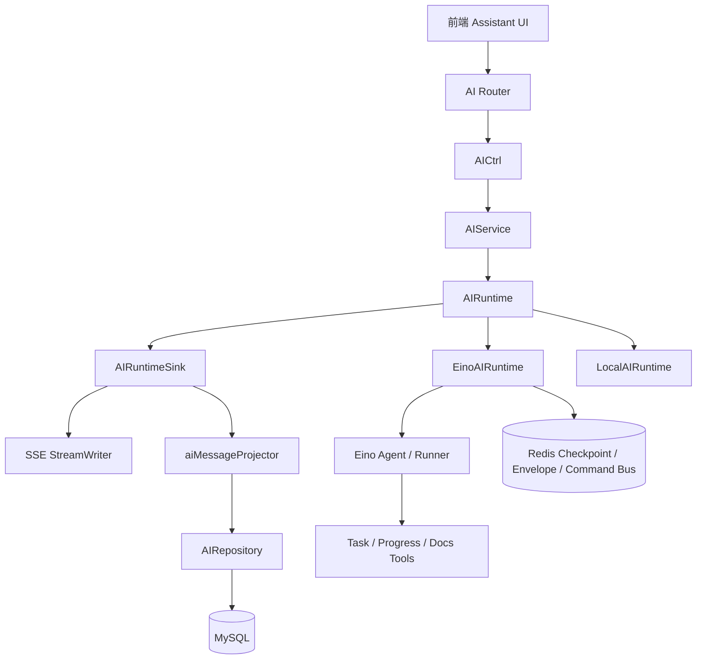
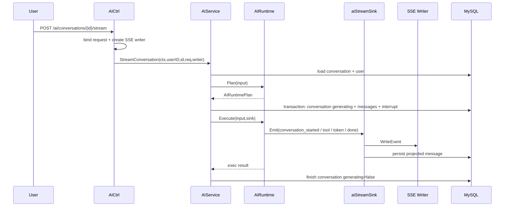
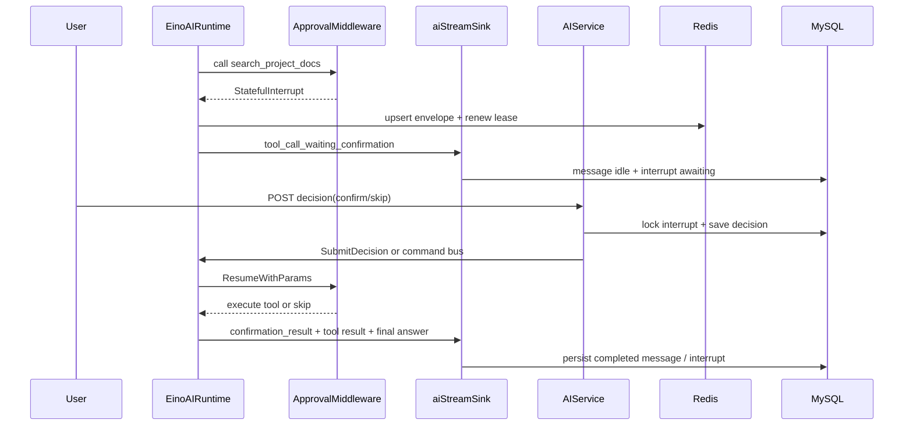

# AI 架构概览

本文只分析 `personal_assistant` 项目中的 AI 子域，不覆盖整个系统。内容基于当前仓库代码整理，重点说明 Router、Controller、Service、Runtime、Sink、SSE、DB 落库、工具调用、用户确认和中断恢复之间的关系。

## 1. AI 架构总览

AI 模块采用清晰的分层链路：

1. Router：注册 `/ai/conversations` 相关路由。
2. Controller：绑定参数、读取当前用户、创建 SSE writer、调用 Service。
3. Service：校验会话归属、生成 plan、创建消息骨架、调用 runtime、收尾状态。
4. Runtime：负责 plan / execute / interrupt / resume / decision。
5. Sink：把 runtime 事件同时写入 SSE 和 DB 消息快照。
6. Repository：持久化 conversation、message、interrupt。
7. Infrastructure：封装 Eino Agent、模型、工具、审批中断、checkpoint、Redis 控制面。

核心设计点是：runtime 不直接操作 HTTP 和 DB；它只向 `AIRuntimeSink` 发事件。`aiStreamSink` 再把事件同步到 SSE 和数据库，因此前端实时看到的内容与历史消息恢复使用同一套数据模型。

当前 AI 子域的主要真相源是：

1. MySQL：
   - `ai_conversations`
   - `ai_messages`
   - `ai_interrupts`
2. Redis：
   - Eino checkpoint
   - runtime envelope
   - runtime command bus
   - recovery lock

MySQL 是业务消息和 interrupt 的真相源；Redis 是运行控制面，不承担业务消息真相。

## 2. 核心链路流程

### 2.1 流式对话主链路

一次流式对话从 `POST /ai/conversations/{id}/stream` 进入：

1. `AIRouter.InitAISSERouter` 注册流式路由。
2. `AICtrl.StreamConversation` 拒绝 query token，绑定 `StreamAssistantMessageReq`，创建 HTTP SSE writer。
3. Controller 调用 `AIService.StreamConversation(ctx, userID, conversationID, req, writer)`。
4. Service 校验 `conversation_id` 与路径一致，检查会话归属和 `IsGenerating`。
5. Service 读取用户和服务端上下文，调用 `resolveRuntimeContext` 生成 `AIResolvedContext`。
6. Service 调用 `runtime.Plan`，由 `planAIRuntime` 判断 lightweight、任务、进度、文档工具。
7. Service 创建 user message、assistant message，必要时创建 `AIInterrupt`。
8. `persistStreamStart` 在事务中锁定会话，写入消息骨架并把会话标记为生成中。
9. Service 创建 `aiStreamSink`，调用 `runtime.Execute`。
10. Runtime 发出 `conversation_started`、`structured_block`、`tool_call_*`、`assistant_token`、`message_completed`、`done` 等事件。
11. `aiStreamSink.Emit` 先写 SSE，再调用 `aiMessageProjector.applyEvent` 更新内存态，最后持久化到 DB。
12. `finishStream` 把会话切回非生成态；如果失败且 SSE 已开始，则通过 SSE 发送错误终态。

### 2.2 文档工具确认链路

文档工具 `search_project_docs` 需要用户确认：

1. Plan 命中文档意图时生成 `DocTool`，Service 创建 `AIInterrupt`。
2. `EinoAIRuntime.Execute` 运行 Eino Runner。
3. `ApprovalMiddleware` 在执行 `search_project_docs` 前抛出 stateful interrupt。
4. `EinoAIRuntime.handleInterrupt` 写入 runtime state，注册等待通道，写 Redis envelope，向前端发送等待确认事件。
5. 前端调用 `POST /ai/conversations/{id}/interrupts/{interrupt_id}/decision`。
6. `AIService.SubmitDecision` 行锁更新 interrupt，向本地 runtime 或 Redis command bus 投递决策。
7. Runtime 收到 `confirm / skip` 后 resume 原 Runner，并继续通过同一个 sink 输出后续事件。
8. 如果 owner 节点丢失，control plane 的 recovery loop 尝试恢复；无法安全恢复时停止该轮。

### 2.3 消息落库与流式输出的关系

Runtime 只产生事件，不直接写数据库。每个事件都会进入 `aiStreamSink.Emit`：

1. 事件 payload 被 JSON 编码。
2. 事件写入 SSE。
3. `aiMessageProjector.applyEvent` 把事件折叠成消息快照。
4. `aiMessageProjector.persistMessage` 更新 `AIMessage` 和必要的 `AIInterrupt`。

这意味着：

1. `assistant_token` 会追加到消息正文。
2. `tool_call_started / tool_call_finished` 会更新 `trace_items`。
3. `structured_block` 会更新 `ui_blocks` 或 `scope`。
4. `tool_call_waiting_confirmation` 会让消息进入等待态，并记录 interrupt。
5. `message_completed` 会把 assistant 消息标记为成功。
6. `error` 会记录 `error_text` 并清理等待态。

## 3. 关键目录与文件说明

### 3.1 核心骨架文件

- `internal/router/system/aiRouter.go`
  注册 AI 会话路由。普通 JSON 接口和 SSE stream 接口分开初始化。

- `internal/controller/system/aiCtrl.go`
  AI HTTP 入口。Controller 只做参数绑定、JWT 用户读取、SSE writer 创建、错误响应，不写业务逻辑。

- `internal/service/system/aiSvc.go`
  AI 业务编排核心。负责会话 CRUD、流式会话执行、interrupt 决策、撤销用户运行中会话、状态收尾。

- `internal/service/system/aiRuntime.go`
  Runtime 抽象定义。核心接口是 `AIRuntime` 与 `AIRuntimeSink`，核心数据是 `AIRuntimePlan`、`AIRuntimeExecutionInput`、`AIRuntimeDecisionCommand`。

- `internal/service/system/aiRuntimeEino.go`
  正式 Eino runtime。负责构建 Runner、执行 Agent、消费 Eino iterator、处理 interrupt、resume checkpoint。

- `internal/service/system/aiRuntimeLocal.go`
  本地 fallback runtime。用于测试、mock、Eino 初始化失败降级；它不调用真实模型，按 plan 模拟输出事件。

- `internal/service/system/aiSink.go`
  Runtime 到 SSE / DB 的桥。`Emit` 负责写 SSE、折叠事件、持久化消息。

- `internal/service/system/aiProjector.go`
  消息投影器。把 runtime 事件转换成 `AIMessage.Content / TraceItemsJSON / UIBlocksJSON / ScopeJSON / ErrorText` 和 interrupt 状态。

- `internal/repository/interfaces/aiRepository.go`
  AI 仓储接口，定义会话、消息、interrupt 的持久化能力。

- `internal/repository/system/aiRepo.go`
  GORM 实现，包含会话行锁、interrupt 行锁、恢复扫描查询和级联删除。

- `internal/model/entity/ai.go`
  三张业务真相表：`AIConversation`、`AIMessage`、`AIInterrupt`。

### 3.2 辅助实现文件

- `internal/service/system/aiPlanner.go`
  共享 planner，Eino 和 Local runtime 都复用它生成 plan。

- `internal/service/system/aiIntent.go`
  轻量意图和业务意图识别。

- `internal/service/system/aiMapper.go`
  ID、标题、预览、DTO 映射、A2UI block、trace item 等辅助构造。

- `internal/service/system/aiContext.go`
  为 runtime 提供服务端上下文、任务快照、训练进度快照。

- `internal/service/system/aiRuntimeFactory.go`
  根据配置选择 `EinoAIRuntime` 或 `LocalAIRuntime`。

- `internal/service/system/aiControlPlane*.go`
  Redis command bus、envelope、recovery loop、后台 resume。

- `internal/infrastructure/ai/eino/agent_factory.go`
  创建 ChatModel、Eino Agent、Runner。

- `internal/infrastructure/ai/eino/approval_middleware.go`
  在指定 tool 执行前触发 Eino stateful interrupt。

- `internal/infrastructure/ai/eino/docs_tool.go`
  文档白名单检索工具。

- `internal/infrastructure/ai/eino/task_progress_tools.go`
  `get_task_snapshot` 与 `get_progress_snapshot` 工具封装。

- `internal/infrastructure/ai/runtimecontrol/*.go`
  Redis envelope store 和 command bus 的基础设施实现。

## 4. 关键函数说明

### 4.1 入口与 Controller

- `AIRouter.InitAIRouter`
  注册会话创建、列表、消息列表、删除、decision 接口。上游是总路由组，下游是 `AICtrl`。

- `AIRouter.InitAISSERouter`
  注册 `POST :id/stream`。这是流式对话入口。

- `AICtrl.CreateConversation`
  输入是 Gin context。绑定 `CreateAssistantConversationReq`，读取 `jwt.GetUserID(c)`，调用 `AIService.CreateConversation`。

- `AICtrl.StreamConversation`
  输入是 Gin context。绑定 `StreamAssistantMessageReq`，创建 `streamsse.NewHTTPStreamWriter`，调用 Service。失败时如果流未开始，返回 JSON BizError；流已开始则不再回写 JSON。

- `AICtrl.SubmitDecision`
  输入是 Gin context。绑定 `SubmitAssistantDecisionReq`，调用 `AIService.SubmitDecision`，返回 decision accepted 响应。

### 4.2 Service 编排

- `NewAIService`
  组装 repo、runtime、SSE policy、control plane。内部通过 `newConfiguredAIRuntimeWithControlPlane` 选择 runtime。

- `AIService.CreateConversation`
  创建会话。读取用户当前组织，把会话写入 `ai_conversations`，返回会话 DTO。

- `AIService.ListMessages`
  校验会话归属后读取消息列表，并把实体转换为响应 DTO。

- `AIService.StreamConversation`
  流式对话主编排。输入用户 ID、会话 ID、请求 DTO、SSE writer；输出 error。它负责校验、plan、消息骨架、interrupt、事务落库、runtime execute、finish。

- `AIService.persistStreamStart`
  在事务中锁定 conversation，避免并发生成；写入 user message、assistant message、interrupt，并把会话标记为 `IsGenerating=true`。

- `AIService.finishStream`
  统一收尾。成功则结束；取消/超时标记 stopped；其他错误写 error 事件和 done 事件。

- `AIService.SubmitDecision`
  决策入口。行锁读取 interrupt，校验状态，写入 decision，再投递给本地 runtime 或远程 owner 节点。

- `AIService.RevokeUserSessions`
  撤销某个用户等待中的 AI 会话。本地 owner 直接调用 runtime，远程 owner 走 command bus。

### 4.3 Runtime 抽象与实现

- `AIRuntime.Plan`
  输入 `AIRuntimePlanInput`，输出 `AIRuntimePlan`。当前 Eino 和 Local 都调用 `planAIRuntime`。

- `AIRuntime.Execute`
  输入 `AIRuntimeExecutionInput` 和 sink。runtime 只负责发事件，不直接写 HTTP / DB。

- `AIRuntime.SubmitDecision`
  把用户决策投递到当前 runtime 的 session registry。

- `planAIRuntime`
  解析用户输入，判断 lightweight、任务快照、进度快照、文档支持，生成工具蓝图和最终回答分支。

- `LocalAIRuntime.Execute`
  按 plan 模拟完整事件流。适合 fallback 和测试。

- `LocalAIRuntime.waitDecision`
  等待用户确认，同时按心跳间隔调用 `sink.Heartbeat` 保持 SSE 连接。

- `EinoAIRuntime.Execute`
  正式执行路径。lightweight 直接降级给 Local；非 lightweight 构建 Eino Runner，运行 Agent，消费 iterator，处理工具事件与最终正文。

- `EinoAIRuntime.handleInterrupt`
  Eino 文档工具审批中断处理。注册等待通道，写 envelope，发送等待确认事件，收到 decision 后调用 Runner resume。

- `EinoAIRuntime.ResumeInterrupted`
  后台恢复入口。根据 interrupt 中的 checkpoint 和 resume target 恢复 Eino Runner，用 persist-only sink 把结果落库。

### 4.4 Sink 与持久化

- `newAIStreamSink`
  创建流式 sink，绑定 SSE writer、AI repo、assistant message 和 interrupt。

- `aiStreamSink.Emit`
  输入事件名和 payload。先 JSON 编码并写 SSE，再调用 projector 更新消息快照，最后持久化。

- `aiStreamSink.Heartbeat`
  在等待 decision 时发送 keepalive，不改变 DB 状态。

- `newAIMessageProjector`
  从已有 message JSON 字段恢复投影器内存态，供流式执行或恢复执行继续折叠事件。

- `aiMessageProjector.applyEvent`
  事件折叠核心。处理 token、工具开始/结束、等待确认、确认结果、结构化块、完成、错误。

- `aiMessageProjector.persistMessage`
  把投影后的 message 和 interrupt 写回 DB，保持历史消息可恢复。

- `newAIPersistOnlySink`
  后台 recovery 使用的 sink。它不写 SSE，只把恢复后的事件投影到 DB。

### 4.5 Eino 基础设施

- `NewChatModel`
  根据 provider 创建 Qwen / OpenAI / Ark 模型。默认 provider 是 qwen，DashScope compatible-mode 是默认 base URL。

- `NewRuntimeAgent`
  创建 Eino deep Agent，注册工具和 `ApprovalMiddleware`。

- `NewRunner`
  创建 Eino Runner，并接入 CheckPointStore。

- `NewApprovalMiddleware`
  包装指定 tool。第一次调用时抛 interrupt；resume 后根据 ApprovalResult 决定执行工具或返回跳过结果。

- `NewSearchProjectDocsTool`
  把文档白名单检索包装为 Eino invokable tool。

- `NewTaskSnapshotTool / NewProgressSnapshotTool`
  把 Service 提供的数据读取函数包装为 Eino tool。

### 4.6 控制面与恢复

- `AIService.StartControlPlane`
  启动 command loop 和 recovery loop。

- `AIService.handleRuntimeCommand`
  处理跨节点 command bus 命令，当前支持提交 decision 和撤销用户会话。

- `AIService.recoverStaleInterruptsOnce`
  扫描长时间未更新的 awaiting / decision interrupt。

- `AIService.recoverInterruptCandidate`
  根据 envelope、lease 和 runtime state 判断恢复或停止。

- `AIService.resumeRecoveredInterrupt`
  加载恢复上下文，调用 runtime 的 `ResumeInterrupted`，使用 persist-only sink 持久化恢复结果。

## 5. Mermaid 图

### 5.1 总体分层图

### 5.2 流式请求链路图

### 5.3 Interrupt / Decision / Resume 图

## 6. 面试时如何介绍这套 AI 架构

可以这样讲：

这套 AI 不是简单的模型代理，而是一个业务内嵌的可恢复流式 Agent 子系统。入口在 Gin Router 和 Controller，Controller 只处理 HTTP、鉴权上下文和 SSE writer。真正业务编排在 `AIService`：它先校验会话归属和并发状态，再生成运行计划，事务化创建用户消息、assistant 消息和必要的 interrupt，然后把执行交给 runtime。

Runtime 通过 `AIRuntime` 抽象隔离，正式实现是 `EinoAIRuntime`，本地降级是 `LocalAIRuntime`。Eino 负责 Agent、Tool、Checkpoint 和 Interrupt / Resume；Local 用于测试和 fallback。runtime 不直接写 HTTP 或数据库，而是只向 `AIRuntimeSink` 发事件。`aiStreamSink` 是系统里的关键桥接层，它把同一个事件同时写到 SSE 和数据库投影，所以实时输出和历史消息恢复是一致的。

人工确认通过 `AIInterrupt`、Eino `ApprovalMiddleware`、Redis checkpoint / envelope 和 decision 接口完成。文档工具执行前会中断，前端提交 confirm / skip 后，系统在原运行上下文里 resume；如果节点丢失，control plane 会尝试恢复或安全停止。这让 AI 对话既能流式输出，又能被持久化、审计和恢复。

## 待确认

当前文档按代码现状整理。以下内容如果后续实现变化，需要同步修订：

1. `planAIRuntime` 当前仍是规则化意图识别，未来如果改成模型辅助规划，本文的 planner 说明需要更新。
2. 当前必须人工确认的工具是 `search_project_docs`，如果更多工具引入确认流程，interrupt 章节需要扩展。
3. 当前 recovery 只能在可证明安全的状态恢复，否则停止该轮；如果未来支持前端断线重连并重新附着原流，需要补充重连协议。
