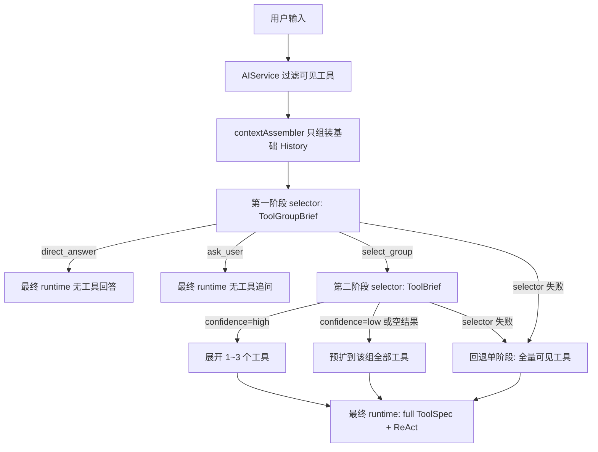

# ReAct 设计

## 当前版本目标

当前实现采用**三段式渐进 Tool 加载**，目标是减少每轮把全部工具详细 schema 一次性暴露给模型的 token 成本，同时保留现有 ReAct 的参数自修正和工具执行稳定性。

完整链路：

1. `ToolGroupBrief`：先选工具组
2. `ToolBrief`：在组内再选候选工具
3. `ToolSpec`：只对最终选中的工具注入完整 schema，再执行最终 ReAct

## 分层职责

- `internal/domain/ai`
  - 定义共享的渐进式选择协议：`ToolGroupBrief`、`ToolBrief`、`ToolGroupSelection`、`ToolSelection`
- `internal/service/system`
  - 过滤本轮可见工具
  - 生成工具组 brief / 工具 brief
  - 调用内部 selector
  - 只把最终选中的工具交给 runtime
- `internal/infrastructure/ai/eino`
  - 实现内部 selector（非流式、严格 JSON 输出）
  - 执行最终 ReAct runtime

## 运行时流程

## selector 规则

### 第一阶段：选组

输入：

- 用户当前 query
- 历史消息
- 当前可见的 `ToolGroupBrief`

输出：

- `decision=direct_answer`
- `decision=ask_user`
- `decision=select_group`

第一阶段不返回用户可见 prose，只返回内部结构化 JSON。

### 第二阶段：组选中后的工具选择

输入：

- 用户当前 query
- 历史消息
- 已选中的 `ToolGroupBrief`
- 该组下的 `ToolBrief`

输出：

- `selected_tool_names`
- `confidence=high|low`

约束：

- 最多选 3 个工具
- `confidence=low` 或空结果时，预扩为该组全部工具
- selector 失败时，直接回退到单阶段全量工具路径

## prompt 与 schema 策略

### 第一、二阶段

第一、二阶段只消费 brief：

- `ToolGroupBrief`
- `ToolBrief`

这里不注入完整 `ToolSpec`，也不展开字段级 schema 细节。

### 最终执行阶段

最终进入 ReAct 时，仍使用完整 `ToolSpec/ToolParameter`：

- enum
- format
- range
- pattern
- examples
- default

但最终执行 prompt 只保留全局规则，不再逐个把所有字段细节重复翻译成大段自然语言。

## 错误恢复语义

最终执行阶段仍保留原有恢复策略：

- `missing_user_input`
  - 追问用户，不继续调工具
- `repairable_invalid_param`
  - 同轮修正参数并重试
- `terminal_tool_error`
  - 终止本轮

渐进式加载只优化“工具发现与暴露”，不改变最终 ReAct 的错误恢复语义。

## 当前工具分组

- `oj_personal`
  - `get_my_ranking`
  - `get_my_oj_stats`
  - `get_my_oj_curve`
- `oj_org`
  - `get_org_ranking_summary`
- `oj_task`
  - `get_task_execution_summary`
  - `list_task_execution_users`
  - `get_task_execution_user_detail`
  - `analyze_task_titles`
- `observability_trace`
  - `query_trace_detail_by_request_id`
  - `query_trace_summary`
- `observability_metrics`
  - `query_runtime_metrics`
  - `query_observability_metrics`

## 默认策略

- 始终启用三段式渐进加载
- selector 对用户完全不可见
- 第一阶段先选组，第二阶段选工具，第三阶段才注入 full spec
- 第二阶段最多选 3 个工具
- 第二阶段 `confidence=low` 时，预扩到该组全部工具一次
- selector 失败时，回退到当前单阶段全量工具路径
- 不引入 ADK，不引入 interrupt/resume，不新增数据库字段
