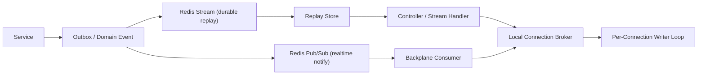

# 项目级 SSE 实时推送基础设施重构指导文档

## 1. 文档定位

本文档是 `personal_assistant` 的项目级实时推送基础设施设计标准，用于统一以下内容：

1. SSE 子系统的职责边界与模块分层。
2. 单机连接管理与多实例事件分发的正式心智。
3. AI 子域、排行榜实时刷新、任务/审批通知等场景的统一接入方式。
4. 安全、稳定性、性能、可观测性与运维基线。
5. 后续代码重构、测试验收与上线治理的统一标准。

本文档不是 AI 子域协议文档，也不是某个单独 handler 的实现说明。

固定边界如下：

1. AI 子域的业务协议、SSE 事件语义、interrupt / resume 运行时约束，仍以 [AI助手架构设计方案.md](./AI助手架构设计方案.md) 为准。
2. 双 Token、Cookie、CORS 相关认证基线，仍与 [双Token认证方案-整合版.md](./双Token认证方案-整合版.md) 保持一致。
3. 多实例事件承载与一致性链路，继续复用项目现有的 Redis Stream + Outbox + Pub/Sub 基础设施心智，参见 [事件驱动架构-RedisStream-Outbox-双通道一致性实践.md](./事件驱动架构-RedisStream-Outbox-双通道一致性实践.md)。

## 2. 反例基线与重构动机

本次设计明确以 `z_cur/zhixin-master` 当前 SSE 实现作为反例基线，而不是复用其实现。

当前反例代码主要集中在：

1. `z_cur/zhixin-master/pkg/sse/sse.go`
2. `z_cur/zhixin-master/api/front/sse/sse.go`
3. `z_cur/zhixin-master/api/front/route.go`
4. `z_cur/zhixin-master/api/front/user/login.go`
5. `z_cur/zhixin-master/tables/members.go`
6. `z_cur/zhixin-master/pages/index2.go`

这套实现存在的核心问题不是“语法旧”或“缺少注释”，而是模型本身不适合作为生产级基础设施继续放大使用：

1. `Hub.Clients` 被多个 goroutine 并发读写，连接注册与消息发送不在同一个受保护的并发域内，存在 `concurrent map read and map write` 风险。
2. 同一条连接会被多个 goroutine 并发写 `gin.ResponseWriter`，SSE 帧可能交叉、脏写、丢帧或触发 race。
3. 鉴权依赖 `query token`，会把敏感凭证暴露到浏览器历史、代理日志、监控与埋点链路。
4. 已建立连接缺乏主动撤销机制，登出或 token 拉黑后，服务端不会主动收回旧连接。
5. 心跳、`retry`、代理 buffering、写超时、慢客户端淘汰、drain 关闭等生产级问题没有被正式建模。
6. 连接状态、消息顺序、消息投递、回放能力与测试基线都没有形成明确的系统设计。

因此本次重构的目标不是“修一个更安全的 handler”，而是把 SSE 从零散写法提升为正式的项目级长连接流式子系统。

## 3. 设计目标与非目标

### 3.1 设计目标

本次 SSE 基础设施固定追求以下 8 个目标：

1. 项目级复用：同一套基础设施同时服务 AI 子域、排行榜刷新、通知推送与后续实时业务。
2. 多实例优先：首版即按多节点部署与跨节点事件分发设计，而不是后补。
3. 并发安全：连接注册表、消息投递、Writer 写出必须具备可证明的并发边界。
4. 安全默认值：不接受 query token，连接鉴权、订阅授权、撤销回收都必须是默认能力。
5. 稳定输出：代理超时、空闲断连、慢客户端、优雅关闭等问题必须显式建模。
6. 高性能：广播不允许因慢连接拖垮整体吞吐，单个连接不能把整个发送链路反压死。
7. 可观测：连接数、丢弃数、重放数、回收数、写超时、鉴权失败都必须能被观测。
8. 与现有仓库一致：遵守当前分层、配置外置、Outbox、Redis Stream、JWT 与观测体系。

### 3.2 非目标

本次设计同时固定以下非目标，避免后续实现时盲目扩张：

1. 不把连接状态存进 Redis 或数据库，连接始终是节点本地资源。
2. 不把 AI token 级流式碎片写入 durable replay 源。
3. 不承诺 AI `session stream` 在断流后重新附着回同一轮运行，V1 仍保持“断流即本轮停止”。
4. 不把 SSE 设计成双向通信协议，客户端主动写入仍走普通 HTTP JSON 接口。
5. 不要求仓库所有实时场景都立刻接入 durable replay；是否 durable 由场景分类决定。

## 4. 总体架构

### 4.1 四层子系统

项目级 SSE 子系统固定拆成 4 层：

1. `HTTP Stream Handler`
   负责 HTTP 绑定、响应头、上下文生命周期、请求体解析、`Last-Event-ID` 读取、连接建立与结束。
2. `Local Connection Broker`
   负责本机连接注册、注销、连接索引、按 `channel / subject` 投递、慢客户端淘汰、连接统计。
3. `Replay Store`
   负责 durable 事件追加、断线回放、回放窗口判断、缺口修复与顺序恢复。
4. `Cross-Node Backplane`
   负责跨节点实时广播与撤销通知，标准实现对接 Redis Pub/Sub。

固定禁令如下：

1. 不能把连接管理、回放、鉴权、业务事件源混写在一个 `Hub` 或一个 handler 内。
2. 不能让业务层直接持有 `ResponseWriter` 或直接向连接写字节。
3. 不能把“本机连接表”和“跨节点消息总线”混成一个概念。

### 4.2 架构心智



### 4.3 仓库落点建议

为避免职责散落，建议后续实现采用以下目录边界：

1. `internal/infrastructure/sse`
   存放 `StreamWriter`、`ConnectionBroker`、`ReplayStore`、`Backplane`、策略对象与具体实现。
2. `internal/controller/system`
   只保留业务入口、HTTP 绑定、鉴权接入与 SSE handler 适配。
3. `internal/service/system`
   只产出业务事件、会话状态与 channel 语义，不感知底层连接写法。
4. `internal/infrastructure/messaging`
   继续复用现有 Redis Stream / Pub/Sub 能力，不重复造轮子。
5. `pkg/observability`、`pkg/jwt`、`pkg/ratelimit`
   继续承接链路观测、鉴权上下文与限流能力。

## 5. 两类流模型

项目内的 SSE 不再被视为单一类型，而是强制分成两类。

| 维度 | `session stream` | `channel stream` |
| --- | --- | --- |
| 典型场景 | AI 单轮对话、interrupt 等待与恢复 | 排行榜刷新、状态通知、审批广播 |
| 路由形态 | `POST + text/event-stream` | `GET + text/event-stream` 或带请求体的 `POST + text/event-stream` |
| 连接归属 | 当前请求、当前节点本地 | 当前订阅者连接、本地维护、跨节点分发 |
| durable replay | 默认不做 | 正式支持 |
| 事件来源 | 当前请求上下文内的运行时事件 | 业务事件、Outbox、Redis Stream |
| Backplane | 不参与主链路 | 正式参与 |
| 断流语义 | 本轮停止，不附着恢复 | 客户端可凭 `Last-Event-ID` 回放缺失事件 |
| 代表模块 | AI 助手 | 排行榜、任务通知、审批提醒 |

固定结论如下：

1. AI 子域只复用 `StreamWriter`、keepalive、错误/完成语义和中断等待模型，不复用排行榜类的 replay / backplane 语义。
2. 排行榜、通知、状态刷新等 `channel stream` 必须具备 durable replay 能力，不能只靠内存广播。
3. 不允许再用“同一套 hub 同时支撑 AI token 流与跨节点广播”的混合设计。

## 6. 正式接口与类型草案

### 6.1 统一事件信封

所有进入 SSE 子系统的业务事件统一抽象为 `StreamEvent`，避免各模块各自拼装帧文本。

```go
type StreamKind string

const (
	StreamKindSession StreamKind = "session"
	StreamKindChannel StreamKind = "channel"
)

type StreamEvent struct {
	EventID    string         `json:"event_id"`
	StreamKind StreamKind     `json:"stream_kind"`
	Channel    string         `json:"channel"`
	TenantID   uint64         `json:"tenant_id"`
	SubjectID  uint64         `json:"subject_id"`
	EventName  string         `json:"event_name"`
	Data       []byte         `json:"data"`
	OccurredAt time.Time      `json:"occurred_at"`
	RetryMS    int64          `json:"retry_ms"`
	Durable    bool           `json:"durable"`
	RequestID  string         `json:"request_id"`
	TraceID    string         `json:"trace_id"`
	Meta       map[string]string `json:"meta,omitempty"`
}
```

字段规则固定如下：

1. `EventID` 是正式事件编号；durable 事件必须可排序或可比较。
2. `StreamKind` 决定事件是否允许进入 replay / backplane。
3. `Channel` 是业务订阅维度，不等于用户 ID，也不直接暴露底层 Redis key。
4. `TenantID` 与 `SubjectID` 用于授权、投递裁剪与审计。
5. `Durable=true` 的事件必须可以被回放；AI token 级碎片默认 `Durable=false`。

### 6.2 连接级策略

连接行为统一通过 `ConnectionPolicy` 管理，不允许把 20 秒心跳、64 队列这类值散落在实现里。

```go
type ConnectionPolicy struct {
	HeartbeatInterval       time.Duration
	WriteTimeout            time.Duration
	QueueCapacity           int
	MaxConnectionsPerSubject int
	ReplayLimit             int
	IdleKickPolicy          string
}
```

默认建议值如下：

1. `HeartbeatInterval`: `15s` 到 `20s`
2. `WriteTimeout`: `5s` 到 `10s`
3. `QueueCapacity`: `64` 或 `128`
4. `MaxConnectionsPerSubject`: 按场景限制，避免单用户或单浏览器无限建连
5. `ReplayLimit`: 按 channel 的单次回放窗口限制
6. `IdleKickPolicy`: 默认 `drop_oldest` 或 `disconnect_slow_consumer` 二选一，本项目推荐默认断开慢客户端

### 6.3 五个基础接口

```go
type Authorizer interface {
	AuthorizeConnect(ctx context.Context, req ConnectRequest) (*Principal, error)
	AuthorizeSubscribe(ctx context.Context, principal *Principal, channel string) error
	FilterEvent(ctx context.Context, principal *Principal, evt *StreamEvent) (*StreamEvent, error)
}

type ConnectionBroker interface {
	Register(conn *Connection) error
	Unregister(connID string)
	PublishToSubject(subjectID uint64, evt *StreamEvent) int
	PublishToChannel(channel string, evt *StreamEvent) int
	RevokeSubject(subjectID uint64, reason string) int
	Stats() BrokerStats
}

type StreamWriter interface {
	WriteEvent(ctx context.Context, evt *StreamEvent) error
	WriteHeartbeat(ctx context.Context) error
	WriteTerminal(ctx context.Context, evt *StreamEvent) error
}

type ReplayStore interface {
	Append(ctx context.Context, evt *StreamEvent) error
	ReplayAfter(ctx context.Context, channel string, lastEventID string, limit int) ([]*StreamEvent, error)
}

type Backplane interface {
	Publish(ctx context.Context, evt *StreamEvent) error
	Subscribe(ctx context.Context, handler func(context.Context, *StreamEvent) error) error
	PublishRevoke(ctx context.Context, revoke RevokeCommand) error
}
```

这些接口的职责边界固定如下：

1. `Authorizer` 负责建连鉴权、订阅授权、事件二次裁剪，避免“能连上就能看到所有事件”。
2. `ConnectionBroker` 只管理本机连接与本机投递，不关心 Redis 或业务真相。
3. `StreamWriter` 只管把 `StreamEvent` 编码成合规 SSE 帧，并处理 flush、heartbeat、写超时。
4. `ReplayStore` 只关心 durable 事件的回放，不持有连接。
5. `Backplane` 只负责跨节点实时广播与撤销消息，不承担 durable 真相。

### 6.4 配置外置建议

SSE 子系统的运行参数必须配置外置，不能把心跳、写超时、队列长度、Origin 白名单硬编码在实现里。

建议落点如下：

1. 在 `internal/model/config` 下新增独立的 `sse.go` 配置结构，或在确认不混淆职责的前提下扩展现有实时相关配置。
2. `ConnectionPolicy` 由配置装配生成，而不是由各业务 handler 自己手写。
3. `AllowedOrigins`、`QueueCapacity`、`HeartbeatInterval`、`WriteTimeout`、`ReplayLimit`、`MaxConnectionsPerSubject`、`DrainTimeout`、`PubSubChannelPrefix`、`ReplayStreamPrefix` 等都应进入配置层。
4. 业务代码只读取 `global.Config`，不直接保留可变常量。

## 7. 并发模型与连接生命周期

### 7.1 固定并发模型

项目级 SSE 的并发模型固定为：

1. Broker 维护受保护的连接注册表。
2. 每个连接持有一个有界发送队列。
3. 每个连接只允许一个 writer loop 实际写 `ResponseWriter`。
4. 业务线程、broker 广播线程、backplane 消费线程都只能向连接队列投递，不能直接写流。

这条规则是整个重构的核心，不允许被破坏。

### 7.2 连接生命周期

标准生命周期如下：

1. Handler 解析请求并完成登录态、租户边界、订阅权限校验。
2. 创建连接对象、绑定 `ConnectionPolicy` 与本地发送队列。
3. Broker 注册连接并建立索引。
4. 如为 `channel stream` 且携带 `Last-Event-ID`，先从 `ReplayStore` 补发缺失事件。
5. 启动该连接唯一的 writer loop，进入实时接收。
6. 持续监听 `r.Context().Done()`、撤销命令、drain 命令与慢客户端淘汰信号。
7. 连接结束时统一注销、清理索引、记录指标与日志。

### 7.3 慢客户端策略

慢客户端处理必须明确，不允许默认阻塞生产者：

1. 每个连接必须有界队列，默认 `64` 或 `128`。
2. 广播或单播时采用非阻塞入队，不等待网络写完成。
3. 队列满时默认断开该连接，并记录 `slow_consumer_drop_total` 指标。
4. 如业务确实需要保留最新态，可在少数场景改为 `drop_oldest`，但不能作为全局默认。

## 8. 发布、回放与多实例分发模型

### 8.1 项目级双通道模型

本项目实时事件固定采用双通道模型：

1. `Outbox -> Redis Stream`
   负责 durable 真相事件的可靠出站、补偿与对账。
2. `Redis Pub/Sub`
   负责跨节点低延迟分发与撤销广播。

固定规则如下：

1. durable 真相先进入 Redis Stream，再根据需要同步触发 Pub/Sub。
2. Pub/Sub 负责“快”，Redis Stream 负责“准”与“可补”。
3. 任何节点如果错过 Pub/Sub 广播，都必须能通过 replay 从 durable 源追平。

### 8.2 channel stream 的正式流程

`channel stream` 的标准流程固定为：

1. 业务变化写 DB。
2. Service 产出业务事件并写入 Outbox。
3. Outbox relay 将事件发布到 Redis Stream。
4. 事件被需要的投影或实时模块消费。
5. 如需要实时刷新，则同时向 Pub/Sub 发送轻量广播或事件摘要。
6. 各节点的 backplane consumer 收到广播后，将事件投递到本机 Broker。
7. 客户端断流重连时，带上 `Last-Event-ID` 从 ReplayStore 回放缺失事件。

### 8.3 session stream 的正式流程

`session stream` 固定采用请求级本地流：

1. 当前 HTTP 请求就是该流的生命周期。
2. 运行期事件直接进入该请求绑定的 writer loop。
3. `tool_call_waiting_confirmation` 期间连接不断开，靠 keepalive 保活。
4. 用户调用 decision 接口后，服务端在原流内继续输出后续事件。
5. 本类流不进入 Redis Stream durable replay，不参与跨节点 backplane 主链路。

## 9. HTTP 协议、客户端与响应规范

### 9.1 项目标准客户端

项目级正式客户端统一采用 `fetch + SSE framing parser`，不把浏览器原生 `EventSource` 作为标准实现。

固定原因如下：

1. `fetch` 更容易统一 `POST /stream` 这类带请求体的流式接口。
2. `fetch` 能显式携带 `x-access-token` 等请求头。
3. `fetch` 更容易统一取消控制、超时控制与业务重试。
4. `EventSource` 的 header 能力受限，不适合作为项目级统一标准客户端。

### 9.2 路由风格

固定路由风格如下：

1. 只读订阅类流允许 `GET + text/event-stream`。
2. 需要请求体、上下文参数或会话状态的流允许 `POST + text/event-stream`。
3. `GET`、`HEAD`、`OPTIONS` 是 safe methods，不允许顺手做状态变更。
4. 建立 SSE 连接时不写入“已读”“消费确认”“在线状态”等副作用。

### 9.3 响应头规范

SSE 响应至少必须包含：

```http
Content-Type: text/event-stream; charset=utf-8
Cache-Control: no-cache
X-Accel-Buffering: no
```

根据场景可补充：

```http
Connection: keep-alive
Vary: Origin
```

跨域且需要凭证时，必须精确指定 Origin，不允许：

```http
Access-Control-Allow-Origin: *
Access-Control-Allow-Credentials: true
```

### 9.4 SSE 帧规范

`StreamWriter` 负责统一编码，业务层不得手拼帧文本。

固定要求如下：

1. 每个事件以空行结束。
2. 多行 payload 必须拆成多行 `data:`.
3. 心跳使用注释行，例如 `: keepalive`。
4. 需要建议重试间隔时可输出 `retry:`.
5. 终止事件与普通事件保持同一编码路径，避免出现两套结束语义。

## 10. 安全基线

### 10.1 鉴权基线

固定安全基线如下：

1. 不接受 query token。
2. 项目标准鉴权走现有 `x-access-token` 头。
3. 若存在 Cookie 参与的跨域场景，必须精确 Origin 白名单并设置 `Vary: Origin`。
4. 不允许在 SSE URL 中拼接 access token、refresh token 或任何敏感业务凭证。

### 10.2 三层校验

建立连接时必须完成 3 层校验：

1. 登录态校验。
2. 租户 / 组织 / 会话归属校验。
3. channel / topic / conversation 订阅授权校验。

任何一层失败都必须在进入流式写出前返回错误，不允许“先连上再说”。

### 10.3 已建连接的主动撤销

连接建立成功后，仍然必须支持主动撤销：

1. 登出后收回该用户相关连接。
2. token 被加入黑名单后收回旧连接。
3. 组织成员资格、权限、topic 订阅范围变化后，收回越权连接。
4. AI 会话失效、轮次结束或被管理员中止后，收回对应 `session stream`。

撤销消息可通过本机命令或 backplane 跨节点广播完成，但都必须回到 Broker 统一收口。

### 10.4 额外安全要求

1. 日志中不得打印原始 token、Cookie、完整敏感 payload。
2. 对连接建立与高频重连必须做限流，防止滥用。
3. `GET` 类 SSE 只能读，状态变更必须走独立 POST / PUT / PATCH / DELETE 接口。

## 11. 稳定性、性能与运维基线

### 11.1 稳定性规则

固定稳定性规则如下：

1. 心跳间隔默认 `15s` 到 `20s`。
2. 每次写事件前设置单次写超时，默认 `5s` 到 `10s`。
3. 写完每个事件后必须 `Flush`。
4. 连接断开统一依赖 `Request.Context().Done()`。
5. 代理层必须关闭 buffering，并把读超时设置到大于心跳间隔的区间。

### 11.2 性能规则

固定性能规则如下：

1. 广播只做快照遍历与非阻塞入队，不让网络写阻塞广播主循环。
2. 严禁用全局 worker 池串行承担连接写出。
3. AI token 流不写 durable replay，避免把高频碎片放大到 Redis Stream。
4. durable replay 只用于排行榜、通知、状态刷新等真正需要补偿的场景。
5. 单用户、单主题的连接数必须有限制，防止浏览器多 tab 或恶意刷连接。

### 11.3 运维与发布

SSE 服务必须支持 drain 模式：

1. 进入 drain 后拒绝新连接。
2. 现有连接发送终止事件或关闭原因。
3. Broker 主动收口本机连接。
4. 最终再执行 HTTP Server 的优雅关闭。

部署策略建议如下：

1. SSE 可以单独 listener，也可以单独 ingress 规则。
2. 不要与普通 JSON API 共享同一套激进 `WriteTimeout`。
3. 代理层必须关闭响应 buffering。
4. 需要高连接数时优先单独调优 SSE 入口，而不是拖着所有 API 一起调。

## 12. 可观测性要求

SSE 子系统至少应暴露以下观测项：

1. 当前连接数、按 `stream_kind / channel / node` 维度的活跃连接数。
2. 连接建立成功数、失败数、授权拒绝数。
3. 广播入队数、丢弃数、慢客户端淘汰数。
4. replay 命中数、窗口越界数、回放条数。
5. 写超时数、flush 失败数、backplane 投递失败数。
6. 主动撤销数、drain 关闭数。

日志至少要带：

1. `request_id`
2. `trace_id`
3. `stream_kind`
4. `channel`
5. `subject_id`
6. `conn_id`
7. `event_id`

## 13. 与当前仓库分层的接入边界

### 13.1 Controller

`internal/controller/system` 只负责：

1. 绑定请求体与路径参数。
2. 获取当前用户与上下文。
3. 调用 `Authorizer` / `Handler` 建立流。
4. 统一返回错误壳或流式响应。

禁止在 Controller：

1. 直接管理连接表。
2. 直接拼装 SSE 帧文本。
3. 直接访问 Redis Stream 或 Pub/Sub。

### 13.2 Service

`internal/service/system` 只负责：

1. 产出业务事件。
2. 决定事件属于 `session stream` 还是 `channel stream`。
3. 完成权限与范围裁剪。
4. 驱动 Outbox、业务状态与 AI 运行时。

禁止在 Service：

1. 直接持有 `ResponseWriter`。
2. 直接往某个连接写数据。
3. 自己维护一套旁路连接缓存。

### 13.3 Repository

`internal/repository` 只负责业务真相持久化，不感知 SSE。

固定规则如下：

1. Repository 不直接发布 SSE 事件。
2. Repository 不管理连接、回放或 topic。
3. durable 事件统一通过 Service + Outbox 出站。

## 14. 模块接入指导

### 14.1 AI 子域接入

AI 子域固定接入方式：

1. 使用 `POST /ai/conversations/{id}/stream` 建立 `session stream`。
2. 运行时事件直接进入请求级 writer loop。
3. `tool_call_waiting_confirmation` 期间仅保活，不切第二条流。
4. decision 接口只提交控制命令，不直接返回 SSE。
5. AI token、思考摘要、工具轨迹等事件默认不写 durable replay。

### 14.2 排行榜接入

排行榜类实时刷新固定接入方式：

1. 业务真相变化先写 DB 与 Outbox。
2. durable 事件进入 Redis Stream。
3. backplane 负责跨节点实时通知。
4. 订阅者通过 `channel stream` 接收更新。
5. 重连时通过 `Last-Event-ID` 从 replay store 补齐缺失事件。

### 14.3 通知与审批接入

通知与审批场景按是否需要补偿分两类：

1. 需要断线补偿、状态一致与历史追平的，走 `channel stream + durable replay`。
2. 只需要当前在线态提醒的，可只走 backplane + 本机 broker，但要在文档里明确“非 durable”。

## 15. 测试与验收清单

### 15.1 单元测试

至少覆盖以下内容：

1. `StreamWriter` 的 `event / id / data / retry` 编码。
2. 多行 data 拆分。
3. heartbeat 帧格式。
4. 终止事件输出。
5. 写超时与 flush 错误路径。

### 15.2 并发测试

并发测试必须启用 `go test -race`，至少覆盖：

1. Broker 注册与注销并发。
2. 单播、广播与撤销并发。
3. 慢客户端淘汰。
4. 多 goroutine 高频投递下无 map race。
5. 同一连接永远只有一个 goroutine 实际写流。

### 15.3 集成测试

至少覆盖：

1. `channel stream` 断线重连与 `Last-Event-ID` 回放。
2. 回放窗口越界与缺口处理。
3. 跨节点 Pub/Sub 分发。
4. AI `session stream` 在 `tool_call_waiting_confirmation` 后持续 keepalive。
5. decision 提交后原流继续输出，不产生第二条流。

### 15.4 安全与运维验收

至少覆盖：

1. token 缺失、权限不足、topic 越权。
2. query token 拒绝。
3. 跨域 Origin 不匹配。
4. token 拉黑或登出后的连接回收。
5. 优雅关闭、drain、代理空闲超时与慢客户端阻塞。

## 16. 建议落地顺序

为避免一次性大改失控，建议按以下顺序推进：

### 阶段 1：先收口基础抽象

1. 定义 `StreamEvent`、`ConnectionPolicy`、5 个基础接口。
2. 建立 `internal/infrastructure/sse` 基础目录。
3. 把 SSE 帧编码与 Writer 行为从业务层剥离。

### 阶段 2：先落本机并发模型

1. 实现 Broker 的受保护注册表。
2. 实现每连接单 writer loop。
3. 实现慢客户端淘汰、连接统计与主动撤销。

### 阶段 3：再接 durable replay 与 backplane

1. 基于现有 Redis Stream 能力接入 `ReplayStore`。
2. 基于 Pub/Sub 接入 `Backplane`。
3. 明确 `channel stream` 的 durable / non-durable 分类。

### 阶段 4：最后迁移业务场景

1. 先迁 AI `session stream`，因为它只依赖本地 writer 与 keepalive 模型。
2. 再迁排行榜与通知类 `channel stream`。
3. 完成并发测试、集成测试、灰度发布与指标观察。

## 17. 最终结论

本项目后续所有 SSE 实现都必须基于以下统一判断：

1. SSE 不是一个零散 handler，而是一套正式的长连接流式子系统。
2. 连接是本机资源，事件才是跨节点资源。
3. AI `session stream` 与排行榜 `channel stream` 必须分开建模。
4. 并发模型的正确性优先级高于语法与样板代码。
5. durable replay 必须依赖正式事件源，不依赖内存连接表。
6. 安全、稳定性、性能与运维能力必须从首版设计时就进入正式约束，而不是上线后补洞。
