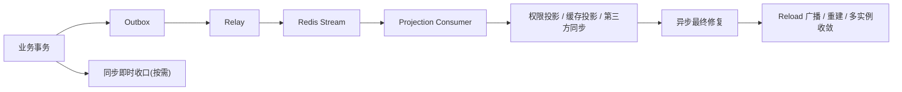

# 我为何要自研一套事件驱动引擎：基于 Redis Stream + Outbox 的一致性设计与落地

很多人一提“事件驱动”，第一反应是上个 MQ，或者把原来的同步调用改成异步调用。但我当时要解决的核心问题，其实不是“缺一个消息队列”，而是“如何把业务真相、投影刷新、多实例收敛、即时生效这些变化，组织成一套能长期运行的机制”。

这个问题又刚好落在很现实的工程约束里: 当前项目跑在一台 `4 核 4G` 的云服务器上，如果为了事件驱动再额外引入一套更重的独立 MQ，资源、部署和运维成本都不划算。所以我需要的不是一套更大的基础设施，而是一套更贴合当前项目的一致性方案。

所以这篇文章里我真正想表达的判断有两层:
**从产品边界看**，我不是在复刻 Kafka、RabbitMQ 这种通用 MQ 产品；
**从项目职责看**，我确实在当前项目里，用 Redis Stream + Outbox + Pub/Sub 组合出一套轻量事件引擎，去承担原本可能交给独立 MQ 的那部分核心角色。

如果先用一句话定义它，我会这么说:
`我自研的，是一套基于 Redis Stream + Outbox + Pub/Sub 的轻量事件驱动引擎，也是一套面向当前项目的一致性事件基础设施。它在本项目里承担了事件承载、异步解耦、消费分发、副作用编排和最终一致性收敛这些核心职责。`

我会按下面这条线讲清楚这篇文章:

1. 我为何没有继续堆同步逻辑，也没有直接把问题丢给现成消息队列。
2. 我说的“自研事件驱动引擎”到底是什么。
3. 这套引擎是怎么设计的。
4. 我在项目里怎么用它。
5. 我为什么要这样用。
6. 最后再回到最初的问题: 为什么这套东西值得自己做。

## 1. 我为何没有继续堆同步逻辑，也没有直接把问题丢给现成消息队列

先说结论: 我真正要解决的不是“消息怎么传”，而是“变化如何被可靠组织起来”。同步硬刷解决不了一致性问题，只会把投影刷新、多实例收敛和外部副作用一股脑塞进主业务；而现成消息队列虽然能解决运输问题，却不会替我定义这套系统该如何收口。对我这个项目、这个阶段、这台 `4 核 4G` 机器来说，它也没有轻到可以无代价引入。

我一开始碰到的问题，看起来很像普通业务膨胀:

1. 用户注册后，不只是写用户表，还要补成员关系、默认角色、当前组织、排行榜快照。
2. 用户切组织、被踢出组织、被恢复成员资格后，不只是数据库状态变了，权限主体、排行榜、用户详情缓存、活跃态都要跟着收敛。
3. 角色菜单 API capability 图谱一变，多实例下的权限投影都要重新对齐。

如果继续用同步直刷，Service 很快就会变成一个什么都做的“脏入口”:

1. 先改 DB。
2. 再刷 Casbin。
3. 再改 Redis hash 和 zset。
4. 再通知别的实例 reload。
5. 再顺手触发第三方同步。

这种写法表面上省事，实际上把几类完全不同的问题混到了一起:

1. 写模型真相。
2. 读模型投影。
3. 权限投影。
4. 多实例收敛。
5. 外部副作用。

主业务一旦把这些事都扛起来，后果一般都差不多:

1. 请求链路越来越长，失败点越来越多。
2. 本实例“刚操作完立刻生效”和全局“最终一致”被混着处理。
3. 业务代码开始知道 Redis、Casbin、广播、重建这些不该由它决定的细节。

那为什么不直接把问题交给现成 MQ?

先说设计原因。现成 MQ 擅长回答的是 `how to transport`，但我这里真正难的是 `how to organize consistency`。我需要回答的不是“消息发没发出去”，而是下面这些更关键的问题:

1. 哪些数据是真相，哪些只是投影?
2. 哪些动作必须立刻生效，哪些可以异步收敛?
3. 哪些事件应该做局部修复，哪些应该做全量重建?
4. 哪些通知需要可靠消费，哪些只需要轻广播?
5. 多实例错过一次广播之后，靠什么重新回到正确状态?

再说工程原因。不是说 Kafka、RabbitMQ 这些方案不行，而是对我当前这个项目和部署条件来说，它们提供的通用能力超过了我这个阶段真正需要的东西，代价也更重。我的目标不是把基础设施堆满，而是在现有资源里把事件驱动真正落地。既然 Redis 本来就是现成依赖，那我更愿意让 Redis Stream 承担可靠事件消费，让 Outbox 补齐可靠出站，让 Pub/Sub 负责轻通知，而不是为了“像标准答案”再额外引入一个更重的独立 MQ。

也就是说，我真正要设计的不是一个“能发消息”的组件，而是一套把一致性规则、事件分流和收口方式固定下来的运行机制。MQ 在这个项目里是被替代的角色，但不是我要复刻的产品形态。

## 2. 我说的自研事件驱动引擎，到底是什么

沿用开篇那句定义，我说的“自研事件驱动引擎”，本质上是一套基于 Redis Stream + Outbox + Pub/Sub 的轻量事件驱动引擎，也是一套面向当前项目的一致性事件基础设施。它要负责的不是单次消息投递，而是从业务事务提交，到事件可靠出站，到异步消费，到投影修复，再到多实例收敛的整条链路。

这套引擎在我的项目里，有一个很明确的边界:

1. 它不负责替代数据库，DB 仍然是真相。
2. 传输层我直接复用 Redis Stream，而不是重造一层通用传输组件。
3. 它在本项目里承担了事件承载、异步解耦、消费分发、副作用编排和最终一致性收敛这些职责。
4. 它不负责承载业务判断，业务规则仍然在 Service 和 Repository 里。
5. 它负责把“业务变化如何可靠出站、如何分类流转、如何驱动投影、如何在多实例下收敛”这套规则固定下来。

这里最重要的是“运行机制”四个字。因为真正难的，从来不是发出一条消息，而是让它在系统里以可解释、可恢复、可重建的方式流动。

## 3. 这套引擎的核心设计：真相层、出站层、传输层、消费层、收敛层

从这里开始，我不再讨论它“像不像 MQ”，而是直接拆开这套机制在工程上如何承担那部分职责。我最后把这套引擎拆成了五个部件。这个拆法不是为了画图好看，而是因为每一层解决的是不同的问题，混在一起就一定会脏。

### 3.1 事件标准化：先把事件说清楚，后面才能解耦

在我的实现里，事件最基础的载体是 `Message`。它统一了几个很关键的概念:

1. `Topic`
2. `Payload`
3. `Metadata`
4. `OccurredAt`
5. `PublishedAt`

这一步看起来很基础，但它决定了后面生产、转发、消费能不能各自独立演进。

如果没有统一的事件信封，后面每个业务模块都会各自定义一套“我要怎么发、我要怎么记 trace、我要怎么带 metadata、我要怎么区分主题”，最后系统里会出现一堆长得像事件、但彼此又不兼容的散装异步逻辑。

我做这一步的目的不是为了抽象，而是为了后面所有事件都能遵循同一套运行方式:

1. 业务侧只关心“我发的是什么事件”。
2. 出站层只关心“我要怎么把这条事件可靠地推出去”。
3. 消费侧只关心“收到这类事件以后应该如何收敛投影”。

### 3.2 可靠出站：业务事务成功之后，事件必须留下来

这一层是整套引擎最硬的一块，没有它，后面全是空中楼阁。

我用 `entity.OutboxEvent` 作为落库事件载体，用 `interfaces.OutboxRepository` 管理它的创建、拉取、发布成功、发布失败这些状态流转。核心思想很朴素:

1. 业务数据和事件数据必须在同一个事务里提交。
2. 只要事务提交成功，就一定有一条待出站的事件记录留下来。
3. 后面的 relay 再慢、Redis 再抖、消费者再失败，也只是“出站延迟”或“投影延迟”，而不是“事件根本没留住”。

Outbox 在这里解决的不是“优雅”，而是“可靠”。因为最难处理的从来不是异步慢，而是 DB 已经成功了，但后面的事件根本没法追了。

我对 `entity.OutboxEvent` 的理解，实际上可以分成三组字段:

1. 事件是谁:
   - `event_id`
   - `event_type`
   - `aggregate_id`
   - `aggregate_type`
   - `payload`
2. 事件现在走到哪了:
   - `status`
   - `retry_count`
   - `error_message`
   - `published_at`
3. 事件从哪个请求链路来的:
   - `trace_id`
   - `request_id`
   - `traceparent`
   - `tracestate`

这样分组之后，运维排查和运行时判断都比较清楚。你既能知道“这是什么”，也能知道“它卡在哪”，还知道“它原来属于哪条请求链路”。

### 3.3 事件传输：我没有自造传输层，而是把 Redis Stream 用在了合适的位置

自研引擎不等于每一层都自己造。

在传输层，我没有自己造队列，而是直接用 `messaging.RedisStreamPublisher` 和 `messaging.RedisStreamSubscriber` 把 Redis Stream 封成统一的发布和消费接口。

我选择 Redis Stream 的原因很明确:

1. 这类事件不是“广播一下知道就行”，而是“要被处理完”。
2. 我要消费组。
3. 我要 ack。
4. 我要积压能力。
5. 我要多实例分摊消费。

所以 Stream 非常适合承接真正的事件消费。

还有一个很现实的原因，就是资源和运维成本。当前项目的吞吐规模、部署复杂度和机器规格，还远远没到必须单独拉一套更重 MQ 集群的阶段。Redis 本来就是现有依赖，在这台 `4 核 4G` 机器上，用 Redis Stream 承接可靠消费，再用 Outbox 补齐可靠出站，整体组件更少、内存占用更可控、部署和维护也简单得多。对我来说，这不是“能不能上更重的 MQ”的问题，而是“有没有必要为当前阶段付出那样的成本”。

但这并不代表我什么都往 Stream 上堆。像 `permission_policy_reload` 这种轻量通知，本质上只是在说“策略已经变了，你 reload 一下”，它不是业务真相，也不需要可靠积压，这种场景我继续用 Pub/Sub，反而更合适。

换句话说，我没有自造传输层，我真正定义的是“什么该进 Stream，什么只做轻广播，什么必须先落 Outbox”的运行规则。真正需要自研的部分，不是 Redis 的能力本身，而是事件在这条链路里如何分流、如何编排、如何收口。

### 3.4 消费执行与投影收敛：事件不是为了热闹，而是为了修复投影

我这里的消费层，核心不是“订阅后打印日志”，而是让事件真正驱动投影收敛。

在这套引擎里，我主要有两类投影事件:

1. `event.PermissionProjectionEvent`
2. `event.CacheProjectionEvent`

前者驱动权限投影，后者驱动缓存投影。对应的编排入口是:

1. `contract.PermissionProjectionServiceContract`
2. `contract.CacheProjectionServiceContract`

这几个名字我保留在文章里，不是为了讲源码，而是为了说明这套引擎不是概念拼贴，它在实现里有很明确的职责归属:

1. 事件类型负责表达“发生了哪种变化”。
2. 投影服务负责决定“收到这类变化以后怎么收敛”。
3. 业务 Service 只负责在事务里写出事件，不再直接刷投影。

这一步非常关键。很多所谓“事件驱动”最后还是会退化成“主业务发消息，消费者里再写一堆业务判断”。那样只是把耦合从同步搬到了异步，并没有真正建立起引擎。

### 3.5 全局一致性收口：真正难的不是消费，而是怎么收敛

如果前面四层解决的是“怎么把变化变成事件”，那这一层解决的就是“系统最后如何回到正确状态”。

我的结论是: 多实例下，一致性收口不能只靠一种手段。

因为系统里同时存在两类需求:

1. 当前实例刚操作完，最好马上看到结果。
2. 所有实例最终都要收敛到同一个状态。

这两件事如果只靠同步，跨实例一定难看；如果只靠异步，本实例体验又会变差。所以最后我把“收口”做成了双通道。

## 4. 双通道为什么是引擎核心，而不是补丁

很多人会把“双通道”理解成对异步架构的补丁。我自己的感受正好相反: 这套引擎真正关键的地方，不在“用了 Redis”，而在“如何把即时体验和最终一致拆成两条收口通道”。所以双通道不是补丁，而是整套引擎真正成立的前提。

### 4.1 主双通道：同步即时收口 + 异步最终修复

主双通道有两条线:

1. `同步即时收口`
2. `异步最终修复`

同步即时收口解决的是“当前实例的即时体验”。

举个最典型的例子，权限主体绑定变化之后，如果用户刚改完组织或角色，马上发下一次请求却还命中旧权限，那这套系统就算最终会收敛，也是不合格的。所以像 `subject_binding_changed` 这种变更，我会在事务提交后先做本实例的同步收口。

异步最终修复解决的是“全局最终一致”。

因为当前实例知道自己刚做了什么，不代表其他实例也知道。只有把事件真正推到异步链路里，再由消费侧回源 DB 修复投影，再做必要的 reload 广播，系统才会在多实例下慢慢收敛。

为什么只靠同步不行?

1. 跨实例无法优雅传播。
2. 图谱级别的变更不适合在请求链路里重建。
3. 请求延迟和失败点会急剧增加。

为什么只靠异步也不行?

1. 当前实例操作完之后不应长时间命中旧状态。
2. 某些体验强相关的结果，本来就应该先就地收口。

所以双通道并不是“多加一层”，而是在单实例即时体验和多实例最终一致之间做的职责分离。

### 4.2 次双通道：relay 周期轮询兜底 + outbox_new_event 通知提速

除了主双通道，我这里还有一个次级双通道，很多人第一次看会忽略。

`outbox.RelayProcessor` 的运行逻辑不是傻轮询，也不是只靠通知，它实际上是两条线一起工作:

1. 周期轮询兜底。
2. `outbox_new_event` 轻通知提速。

也就是说:

1. 就算通知丢了，轮询还会把事件捞起来。
2. 就算轮询周期还没到，新事件写出后也能尽快唤醒 relay。

这段逻辑我更愿意用伪码来解释:

```go
func Run(ctx) {
    subscribe("outbox_new_event")
    every(1 * time.Second, func() {
        processPending()
    })
    onNotify(func() {
        processPending()
    })
}
```

这就是我想表达的“引擎意识”: 我不是单纯在用 Redis 的某个功能，而是在设计一套失败可兜底、时效可提升的运行机制。

整个引擎的流动关系可以概括成下面这张图:



## 5. 我在项目里怎么使用它：权限投影、缓存投影、第三方同步

到这里再回头看业务场景，顺序就对了。因为此时权限投影、缓存投影不再只是文章里的例子，而是这套引擎已经在真实项目里承担事件承载、消费分发和副作用编排职责的证据。

### 5.1 权限投影：让权限变化先收口，再传播

权限链路里，我主要用了三类信号:

1. `subject_binding_changed`
2. `permission_graph_changed`
3. `permission_policy_reload`

这三者的职责完全不同:

1. `subject_binding_changed` 表示主体和角色绑定发生变化，适合做局部修复。
2. `permission_graph_changed` 表示整张权限图谱变了，适合异步全量重建。
3. `permission_policy_reload` 只是轻广播，告诉其他实例可以 reload 了。

这就是我为什么说“事件引擎”的核心不是消息，而是分类和收敛策略。因为如果这三件事都用同一套处理方式，系统不是过重，就是不稳。

权限投影这条链路里，`contract.PermissionProjectionServiceContract` 的职责不是承载业务授权，而是承载投影收敛。它只回答一件事: 这类权限事件来了以后，应该局部修，还是全量重建。

它的分发逻辑很适合用一小段伪码说明:

```go
switch event.Kind {
case "subject_binding_changed":
    SyncSubjectRoles(userID, orgID)
case "permission_graph_changed":
    RebuildAll()
}
BroadcastReload()
```

这段伪码背后反映的是一条很重要的设计原则:

`事件种类的划分，要和收敛成本匹配。`

局部变更就局部修，图谱变更就全量建，不要为了“优雅”强行统一。

### 5.2 缓存投影：事件尽量轻，消费端尽量回源

缓存链路是另一个很典型的样本。

我这里不会在事件里塞完整的排行榜快照，也不会在业务事务里直接手工去改一堆 Redis key。缓存投影事件只传最小必要信息，比如:

1. 发生了哪类变化。
2. 影响了哪个用户。
3. 影响了哪些组织。
4. 当前组织是否发生了切换。

然后由 `contract.CacheProjectionServiceContract` 在消费侧统一回源 read model，再决定:

1. 是写用户详情 hash。
2. 还是同步组织榜单和总榜单。
3. 是删除旧组织残留排名。
4. 还是把活跃态一并补齐。

我这样做的原因很简单: 缓存是投影，不是第二真相。既然它只是投影，那么事件就不应该承载过重的快照语义，最终状态应该以最新 read model 为准。

这也是为什么我一直不喜欢“把全量快照塞进事件”的设计。消息一旦背上完整快照，生产方和消费方都会被它绑死，后面结构一变，整条链都会被拖着改。

### 5.3 第三方同步：同一套引擎，不同的落地场景

OJ 同步、第三方资料刷新这类逻辑，在我的设计里也会挂到同一套引擎上，但我不会把它们扩成主线。

原因很明确: 这些只是“这套事件引擎还能承接哪些副作用”的证明，而不是它成立的前提。真正证明这套引擎成立的，还是它有没有把业务真相、投影刷新和多实例收敛这三件事拆开。

## 6. 我为什么这样使用：事件分类、同步异步边界、回源策略

如果只写“我怎么用”，文章会变成一个用法清单。真正有价值的部分，其实是“我为什么这样用”。前面讲的是落地方式，这一节讲的是这套机制背后的规则。

### 6.1 为什么事件要分类，而不是只做一个大而全的 topic

事件分类不是为了好看，而是为了让收敛策略和影响范围一致。

在我的实现里:

1. 主体绑定变化是一类事件，因为它天然适合局部修复。
2. 权限图谱变化是一类事件，因为它天然适合全量重建。
3. 缓存投影变化是一类事件，因为它天然依赖 read model 回源。

如果把这些变化都塞进一个大 topic，再在消费者里做巨大的 if else，最后的结果只会是:

1. 事件语义越来越模糊。
2. 消费端越来越像另一个业务 Service。
3. 重建、回放、排障都越来越难。

### 6.2 为什么有些事同步做，有些事异步做

同步和异步的边界，我只看一件事:

`它是否强依赖当前实例的即时体验。`

像主体角色变化，当前实例最好马上生效，所以我会做同步即时收口。

像权限图谱重建、排行榜投影修复、组织榜单清理，这些都不值得强行塞进当前请求链路里，我更愿意让它们进入异步通道，靠最终一致收敛。

这就是为什么我说，自研引擎不是为了复杂，而是为了把“什么值得同步、什么应该异步”变成系统级规则，而不是留给每个 Service 自己决定。

### 6.3 为什么消费侧要统一回源，而不是相信事件里携带的快照

这个问题在缓存投影里尤其关键。

我更偏向让事件表达“变化事实”，而不是表达“最终快照”。原因有三个:

1. 最终状态可能在消费时已经发生新变化。
2. 快照越重，事件结构越难演进。
3. 让消费侧回源 read model，系统会更容易保持单一口径。

所以我现在更愿意让事件告诉系统“谁变了、变了什么类型、影响范围是什么”，至于最终投影长什么样，统一由消费侧基于最新数据决定。

### 6.4 为什么 reload 用轻广播，而不是也放进可靠消费链路

这也是一个典型的“不是所有东西都该走重链路”的问题。

`permission_policy_reload` 的意义，不是表达业务变化，而是表达“变化已经被处理完了，你可以刷新一下本地状态”。它本质上是一个运行时通知，而不是业务真相的一部分。

既然如此，它就没有必要像业务事件一样要求积压、ack、重放。把它做成轻广播，反而更干净。如果某个实例刚好错过了这次广播，系统还有下一次图谱变化、下一次重建、实例重启、人工 `RebuildAll` 这些手段把它拉回来。

## 7. 失败语义、重建能力、可运维性

这套引擎的价值不在绝对实时，而在失败可解释、状态可追踪、投影可修复。

我做这套引擎时，一个非常明确的原则就是:

`失败不可怕，状态不可解释才可怕。`

所以我不会承诺什么“绝对实时”“零延迟”“永不丢失”的漂亮话。我只要求系统在失败时满足三件事:

1. 业务真相仍然可靠。
2. 当前状态可以解释。
3. 后续状态可以修复。

具体来说，这套引擎里的失败语义大概是这样:

1. 事务成功但 relay 暂时没跑起来:
   - 影响的是出站速度，不影响 DB 真相。
2. Redis Stream 发布失败:
   - Outbox 还在，状态可见，可重试。
3. Consumer 处理失败:
   - 影响的是投影收敛速度，不影响真相。
4. 某实例错过 reload 广播:
   - 影响的是本地刷新时效，不影响后续重新收敛。

这也是为什么我一直强调“重建能力”不是补救措施，而是设计的一部分。

权限投影要能 `RebuildAll`，缓存投影也要能全量回源重建。因为只要系统里有投影，就一定会有:

1. 积压。
2. 延迟。
3. 漏广播。
4. 人工修数。
5. 实例重启。

没有重建能力的投影系统，本质上就是一次性脚本，不是引擎。

## 8. 最后回到问题：为什么这套引擎值得自己做

写到这里，再回头看“为什么要自研”这个问题，答案其实可以收成两层: 一层是设计收益，一层是工程收益。

我不是为了造一个新概念，也不是为了让技术栈看起来更重。我自研这套事件驱动引擎，真正想拿到的，是把原本容易散落在业务代码里的那部分一致性规则，沉淀成系统级机制，同时又不为此额外背上一套过重的基础设施。

先说设计收益。我真正想掌控的不是“有没有上 MQ”，而是这套系统里最容易失控的那部分规则:

1. 业务真相和投影的边界。
2. 单实例即时体验和多实例最终一致之间的收敛策略。
3. 事件分类、回源方式、重建能力这些属于我自己业务模型的规则。

现成消息中间件当然很成熟，但它解决的是运输问题，不会替我定义:

1. 哪些变化应该先同步收口。
2. 哪些变化适合异步局部修复。
3. 哪些变化必须异步全量重建。
4. 哪些通知只是运行时广播。
5. 哪些投影必须支持回源重建。

这些问题如果不自己定义，最后就一定会重新散落回业务代码里。表面上你用了异步，实质上只是把混乱从同步链路搬到了异步链路。

再说工程收益。对我当前这台 `4 核 4G` 云服务器来说，我并不想为了落地事件驱动，再额外扛一个更重的独立 MQ 及其部署维护成本。既然 Redis 已经是现有依赖，那我更愿意把 Redis Stream、Pub/Sub 和 Outbox 组合起来，让它在当前阶段承担掉项目里的 MQ 核心职责，把资源和复杂度都压在一个更合理的范围内。

所以对我来说，“自研事件驱动引擎”的价值，从来不在于“我自己写了多少组件”，而在于我把原本容易散落在业务代码里的那部分一致性规则，沉淀成了一套系统级运行机制；同时在当前资源条件下，我又不需要为此额外背上一套过重的独立 MQ 基础设施。业务事务只关心真相落库，Outbox 保证变化被留下，Redis Stream 承接真正需要被处理完的事件，投影服务负责收敛，双通道保证即时体验和最终一致可以同时成立。

如果要用一句话收尾，我会这么说:

`我自研的不是 Kafka、RabbitMQ 这类通用 MQ 产品，但我确实在当前项目里，用 Redis Stream + Outbox + Pub/Sub 做出了一套足以承担独立 MQ 核心职责的轻量事件驱动引擎。`
